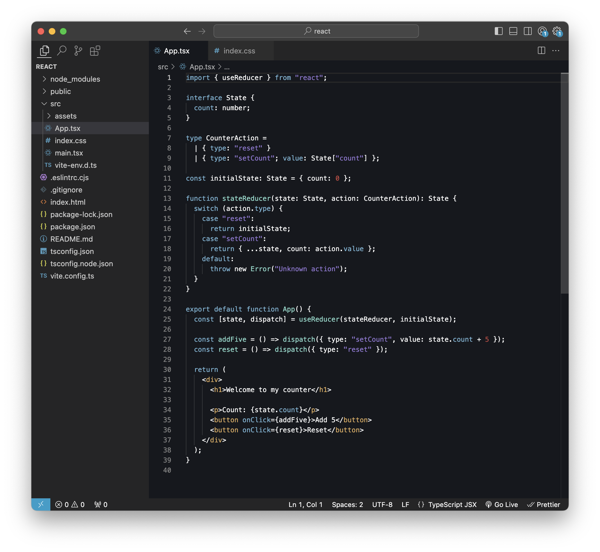
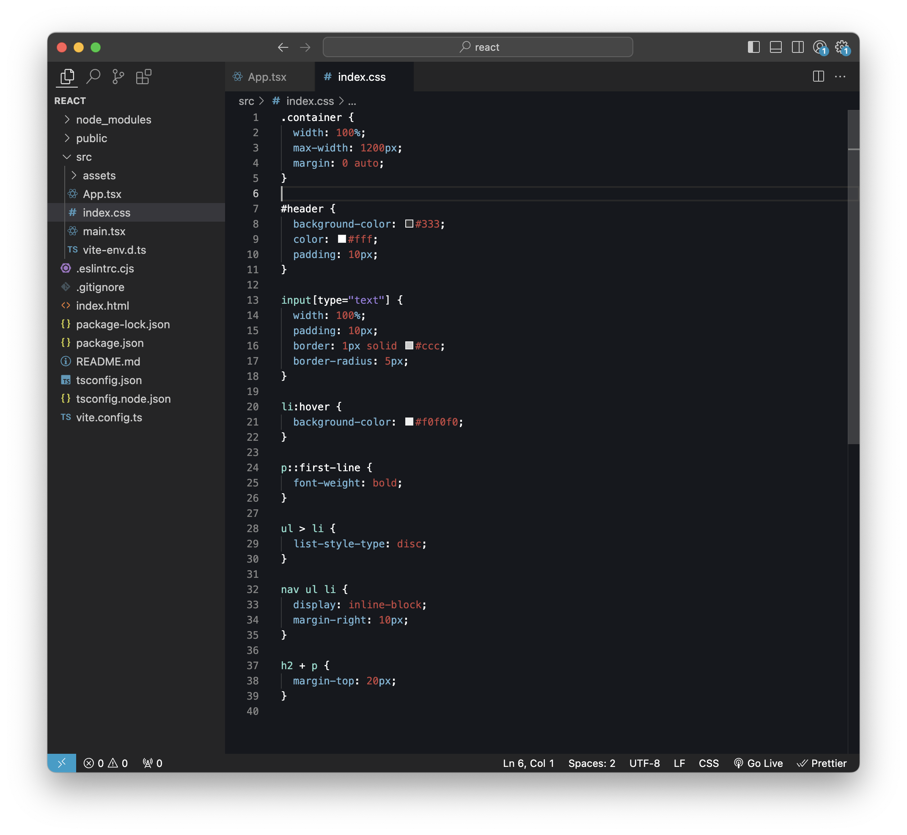

# React Dark Theme for Visual Studio Code

A dark theme inspired by React website to enhance your coding experience in VS Code.

## Features

- Stylish and comfortable environment for coding.
- Carefully selected colors for enhanced readability.
- Customized for React developers.

## Installation

1.  Install [Visual Studio Code](https://code.visualstudio.com/)
2.  Launch Visual Studio Code
3.  Choose **Extensions** from menu
4.  Search for `react dark theme`
5.  Click **Install** to install it
6.  Select the theme and press Enter.
